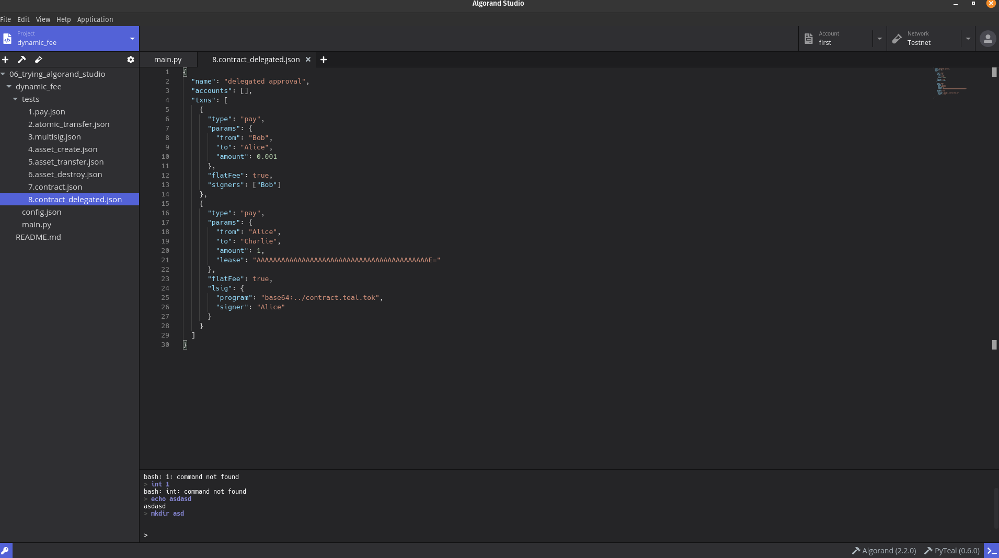

# Trying Out Algorand Studio

See:
* Tutorial: https://developer.algorand.org/tutorials/algorand-studio-tutorial-1-basic-features/

I installed the appimage. Seems to work alright.

I initialised the Dynamic Fee template.

## Thoughts

Pros:
* Can send test transactions easily by clicking on the testtube.
* Can manage addresses very easily using key manager.
* Nice templates.

Cons:
* Looks nice but does not seem to provide all that much benefit compared to just vscode.
* The testnet node docker container needs to spend hours or days catching up, whereas a self-managed node can use the catchup command to catchup in minutes.

Issues:
* When editing files, ctrl+s completely removes the code from the screen (!!!)

